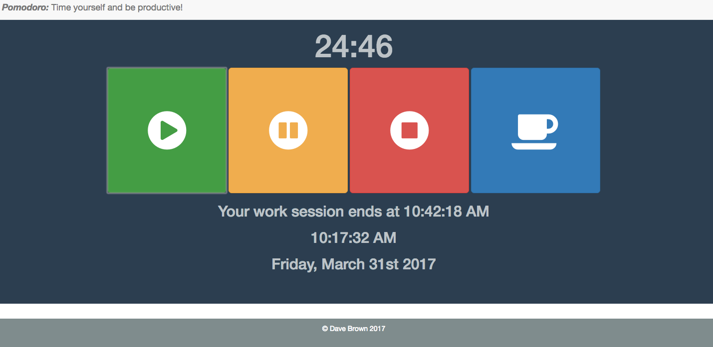

# Pomodoro Timer!
> A productivity timer done in Javascript, HTML and CSS. View it here:  https://davebza.github.io/pomodoroTimer/

Need to get things done? Break up your efforts into short goals, and give yourself 25 minutes to hit your target. When your time is done, take a five minute break and then repeat! You'll be smashing productivity records in no time!

Featuring large icon-based buttons, this app is designed for ease of use - so you can get on to the more important things!

## Installation

Download all files, preserve folder hierarchy, and open index.html in a web browser.

## Usage example

You can select 25 minute work sessions and 5 minute break sessions. Both of these can be paused.

Each session type will also show the exact end time of the session, and appropriate messages replace the end time if the timer is paused.

An accurate date and time is also output to the browser at all times.

## Meta

Dave Brown – [@DaveBza](https://twitter.com/DaveBza) – dave@davidbrownhk.com

[https://github.com/davebza/github-link](https://github.com/davebza/)
